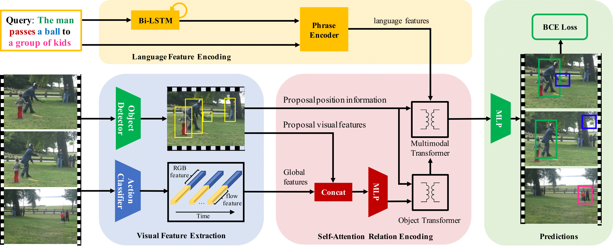

# Model

## File Organization

1. `main_dist.py` is the main file.
1. `dat_loader_simple.py` processes the data. In particular, the SPAT/TEMP/SEP part is modular, can be easily extended to a newer dataset.
1. `contrastive_sampling.py` as the name suggests creates the contrastive samples for Training. The validation file already contains these indices.
1. `mdl_base.py` is the base model, which just defines bunch of functions to be filled in.
1. `mdl_conc_single.py` implements concatenation models and losses for SPAT/TEMP. Similarly, `mdl_conc_sep.py` implements SEP concatentation model and loss. These are kept modular, so that they can be re-used with newer models with ~~minimal~~ some effort.
1. `mdl_vog.py` contains the main model implementations of baselines and vog.
1. `mdl_selector.py` returns the model, loss and evaluation function to be used based on input arguments.
1. `eval_vsrl_corr.py` is the top-level evaluation functions for each of SEP/TEMP/SPAT which processes the output of the model and converts them to uniform format for evaluation.
1. `eval_fn_corr.py` contains the main logic for evaluating the models.
1. `_init_stuff.py` initializes paths to be included, typings, as well as yaml float loader (otherwise 1e-4 cannot be read correctly).
1. `extended_config.py` has some handy configuration utils.
1. `transformer_code.py` has the transformer implementation, also has the relative transformer which uses relative position encoding (RPE).

Some other useful files are under [`utils`](../utils/)
